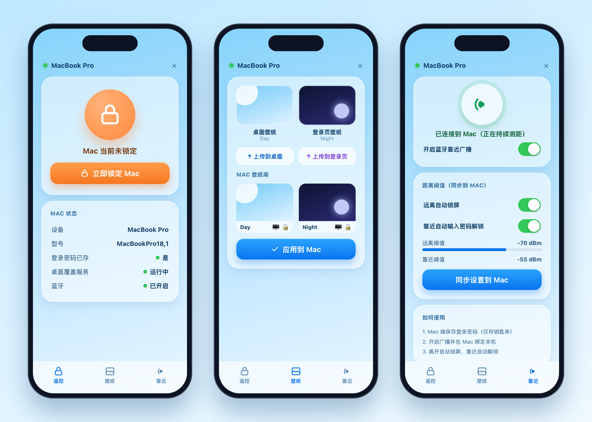
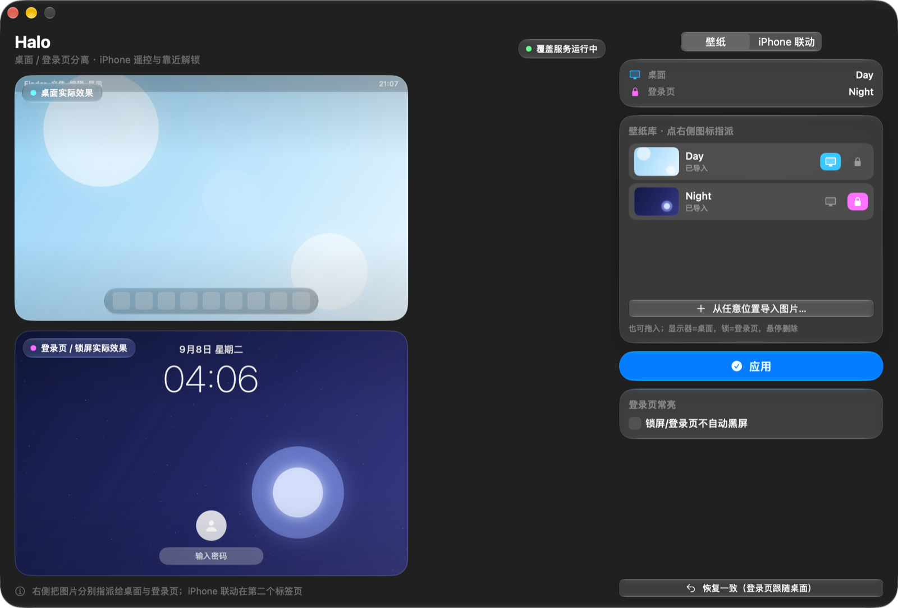
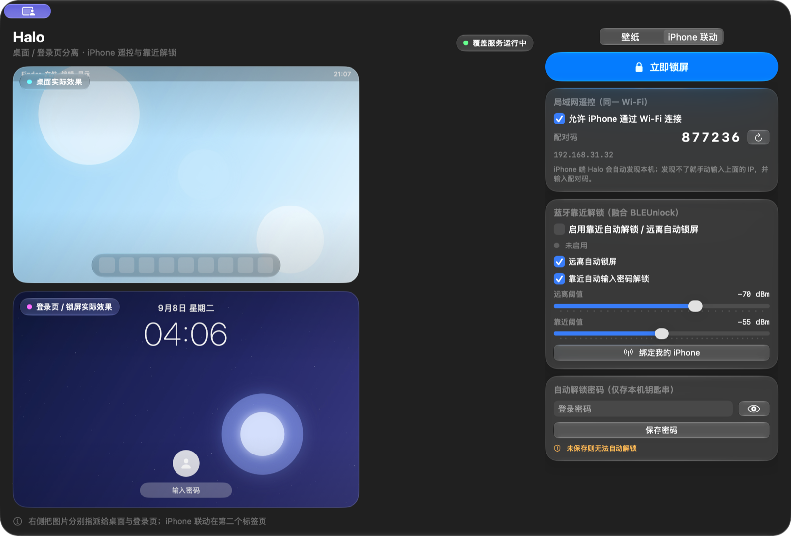

<div align="center">
  
  <h1>Halo</h1>
  <p><b>Mac 桌面 / 登录页壁纸各自独立，再用 iPhone 遥控锁屏、远程换壁纸、靠近自动解锁。</b></p>
  <p>
    
    
    
    
    
  </p>
  <p>
    <a href="https://lucasxcn.github.io/Halo/">🌐 官网 / 下载</a> ·
    <a href="https://github.com/LUCASXCN/Halo/releases/latest">⬇ 最新 Release</a>
  </p>
</div>

---

Halo 由两部分组成：

- **Halo（Mac）**：从 macOS Tahoe（26）开始，系统把静态壁纸的「桌面」和「锁屏 / 登录页」强制绑定。Halo 用纯用户态的方式让二者各自独立——桌面一张、开机登录页另一张，铺满全屏、重启保持；同时是一个纯菜单栏常驻的小工具，关掉主窗口也只在菜单栏运行。
- **HaloRemote（iPhone）**：同一 Wi‑Fi 下自动发现 Mac，一键远程锁屏、远程挑选 / 上传并更换桌面与登录页壁纸；再借助蓝牙（BLE）信号强度，实现**离开自动锁屏、回到电脑前自动输入密码解锁**（思路与 BLEUnlock 一致，已内建进 App，无需再装别的东西）。

## 功能

### 🖥️ Mac 端

- **桌面 / 登录页双壁纸独立**：桌面看一张、锁屏和开机登录页看另一张，各自铺满全屏、互不影响，重启后自动保持。
- **纯菜单栏常驻**：关闭主窗口后 Dock 不显示，只在菜单栏留一个图标，点击即可重新打开主界面、立即锁屏或退出。
- **反转法稳定实现，不关 SIP、不要 root**：用系统公开接口设置壁纸，再用一个用户态、点击穿透的桌面层显示桌面图；一锁屏该层自动隐藏，露出登录页壁纸，不跟系统抢缓存文件。
- **任意位置导入，复制进 App 管理**：不依赖任何固定文件夹，从访达任意位置选图或直接拖入即可；导入即复制到 App 内部，原图不动、换电脑也不影响。
- **桌面完全正常可用**：覆盖层点击穿透，图标单击、双击、框选、右键，多显示器、Mission Control、全屏空间都正常。
- **自动充满屏 + 登录页常亮（可选）**：按屏幕物理像素居中裁剪不拉伸；可让停留在锁屏时不自动黑屏。

### 📱 iPhone 端（HaloRemote）

- **一键远程锁屏**：同一 Wi‑Fi 下自动发现 Mac，也可手动输入 IP，点一下立即锁定 Mac。
- **远程换壁纸**：在手机上浏览 Mac 壁纸库、分别指派桌面 / 登录页并应用；可直接从**相册上传图片**到 Mac，再设为壁纸。
- **蓝牙靠近自动锁 / 解锁**：iPhone 持续广播 BLE，Mac 实时测距——信号弱于「远离阈值」自动锁屏，回到「靠近阈值」内自动输入密码解锁；阈值可在手机上调节并同步到 Mac。
- **Liquid Glass 界面**：SwiftUI 原生打造，适配 iOS 26 / 27 的玻璃质感设计。
- **自动发现 + 配对码**：Bonjour 自动发现在同一局域网的 Mac，6 位配对码校验，错误配对一律拒绝。

## 效果展示

### iPhone HaloRemote（遥控 / 壁纸 / 靠近）



### Mac 主界面

| 壁纸分离 | iPhone 联动（配对 / 蓝牙靠近） |
| :---: | :---: |
|  |  |

| 桌面壁纸 | 锁屏 / 登录页壁纸 |
| :---: | :---: |
|  |  |

## 系统要求

- **Mac**：Apple Silicon（M1 及更新）或 Intel 芯片（Universal 通用二进制），**macOS 26（Tahoe）及以上**（在 macOS 27 上开发与实测）。
- **iPhone**：**iOS 26 及以上**（iOS 27 实测），需要与 Mac 处于同一局域网，并开启蓝牙。
- 「桌面 / 锁屏壁纸分离」依赖 macOS 26 的桌面层机制；更早系统本身就支持分别设置，无需本工具。

## 安装

### Mac

1. 到 [Releases](https://github.com/LUCASXCN/Halo/releases/latest) 下载 `Halo.zip`，双击解压得到 `Halo.app`。
2. 把 `Halo.app` 拖进「应用程序」文件夹。
3. 首次**右键 `Halo.app` → 打开**，在弹窗里再点一次「打开」（未公证，第一次需右键打开，之后可正常双击）。
4. 首次启动会依次申请「本地网络」「蓝牙」权限，请点「允许」；App 会安装一个仅当前用户运行的登录项用于开机恢复双壁纸。

### iPhone（HaloRemote）

Release 里的 `HaloRemote-unsigned.ipa` 是**未签名**安装包（arm64）。用「全能签」等自签工具重签后侧载安装即可：

1. 用签名工具导入 `HaloRemote-unsigned.ipa`，用自己的证书签名并安装到 iPhone。
2. 首次打开若提示「不受信任的开发者」，到「设置 → 通用 → VPN 与设备管理」里信任对应证书。
3. 确保 iPhone 与 Mac 连在同一 Wi‑Fi、蓝牙已开启。

## 使用

1. Mac 端打开 Halo，在「iPhone 联动」页勾选「允许 iPhone 通过 Wi‑Fi 连接」，记下 6 位配对码。
2. iPhone 打开 HaloRemote，它会自动发现这台 Mac；发现不了就手动输入 Mac 上显示的局域网 IP。
3. 输入配对码连接，之后即可：遥控锁屏、在「壁纸」页远程换图 / 从相册上传、在「靠近」页开启蓝牙广播。
4. 想用靠近自动解锁：先在 Mac「iPhone 联动」页把**登录密码存入钥匙串**（仅保存在本机钥匙串），再点「绑定我的 iPhone」并在手机上开启广播；离开自动锁屏、靠近自动解锁。
5. 壁纸分离本身：Mac「壁纸」页导入图片，分别点 🖥️ / 🔒 指派给桌面与登录页，点「应用」，按 `Control + Command + Q` 锁屏即可看到另一张登录页图。

## 工作原理（简述）

**壁纸分离**：macOS 26 对静态图片强制「锁屏镜像桌面」，并会反复用桌面图重建锁屏缓存。Halo 反过来利用这一点——先用公开接口 `NSWorkspace.setDesktopImageURL` 把「登录页图」设为系统真正的壁纸（于是锁屏 / 登录页天然等于它），再由一个位于桌面壁纸层之上、桌面图标之下的**点击穿透覆盖窗**渲染「桌面图」；锁屏瞬间系统隐藏所有用户层窗口，覆盖窗消失露出登录页图，解锁后覆盖窗回来。全程用户态、无 root、无 SIP 改动。

**局域网遥控**：Mac 在 `_halo._tcp` 上做 Bonjour 广播并监听本地 HTTP 服务，iPhone 通过 NWBrowser 发现、NWConnection 直连；每个请求都带 6 位配对码（`X-Halo-Code` 头）校验，错误即返回 401，连接仅限同一局域网，不经过任何云端服务器。

**蓝牙靠近**：iPhone 用 CBPeripheralManager 广播固定 Halo 服务，Mac 用 CBCentralManager 扫描并持续读取 RSSI 估算远近，跨越阈值时分别触发 `SACLockScreenImmediate` 锁屏、或用 CGEvent 模拟键盘输入已保存在钥匙串中的密码完成解锁。

## 隐私与安全

- 所有壁纸、配置只保存在 Mac 本机 `~/Library/Application Support/Halo/`。
- 遥控与传图只在**同一局域网 + 蓝牙**内进行，App 不连接任何外部服务器、不上传、不埋点。
- 6 位配对码拦截未授权访问；Mac 登录密码**只保存在 macOS 钥匙串**，手机端不接触、不存储该密码。

## 从源码构建

无需打开 Xcode，脚本使用工具链绝对路径直接命令行编译：

```bash
git clone https://github.com/LUCASXCN/Halo.git
cd Halo
./build-mac.sh     # 产物 build/Halo.app（universal2，最低 macOS 26）
./build-ios.sh     # 产物 HaloRemote-unsigned.ipa（arm64 未签名，最低 iOS 26）
```

## License

[MIT](./LICENSE)
